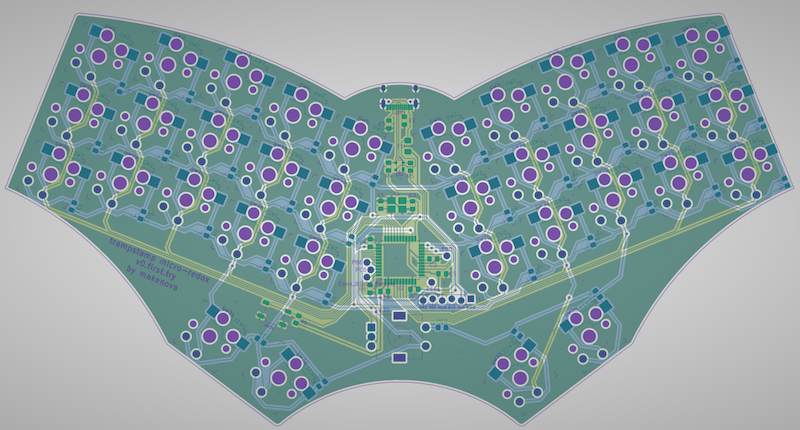

# micro_redox_semi_split

### Features

- USB C
- integrated mcu
- rotary encoder
- choc spaced
- hot-swap or soldered

There are production files in the "gerbers" directory for the pcb and a skeleton case.
Simply upload the zip files to your PCB manufacturer of choice.

If you do not get this assembled by a factory you can find an interactive BOM in `bom` directory.

Starting firmware can be found on my QMK fork in the [`makenova`](https://github.com/makenova/qmk_firmware/tree/makenova/keyboards/makenova//micro_redox/semi_split) branch.
