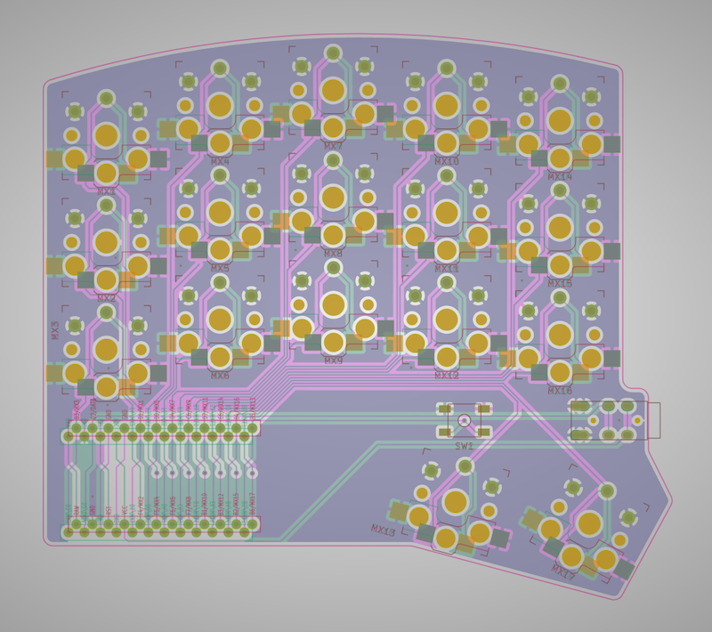

# micro_redox_split

A diodeless, pro-micro, reversible pcb, choc spaced, semi split, 34 key keyboard.  
There are production files in the "gerbers" directory for the pcb and a skeleton case.
Just upload the zip files to your PCB manufacturer of choice.

You'll also need

* Pro Micro(PM) or compatible board
 * I prefer something with USB C
 * You can use a nice!nano if you want to make it wireless
* Headers for the PM
* TRRS jack
* choc hot-swap sockets(optional)
* reset switch (optional)

Starting firmware can be found on my QMK fork in the [`makenova`](https://github.com/makenova/qmk_firmware/tree/makenova/keyboards/makenova//micro_redox/split) branch.
